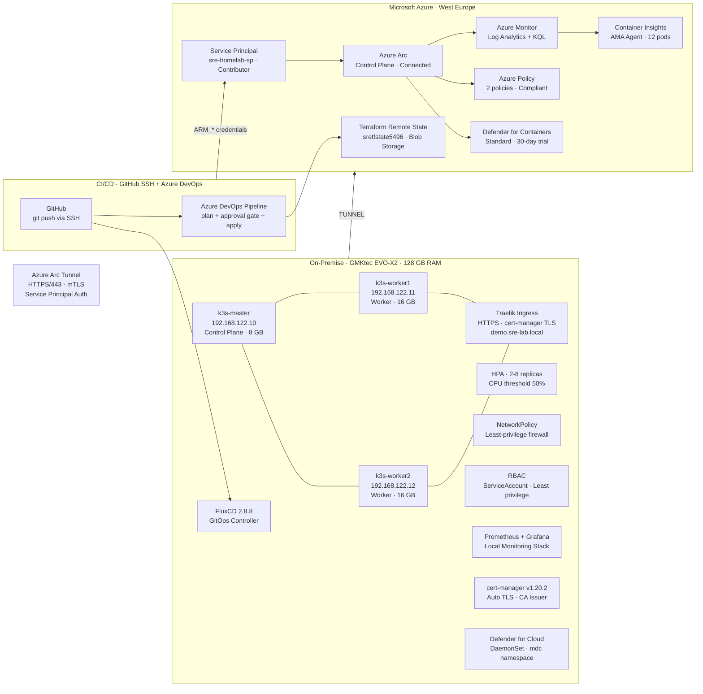

# SRE Homelab: Azure Arc Hybrid Cloud Lab

> **A Proof-of-Value project demonstrating hybrid cloud orchestration, Kubernetes,
> Infrastructure-as-Code, observability, FinOps, Policy as Code, CI/CD pipeline
> automation, advanced Kubernetes operations, GitOps, security scanning, and automated
> TLS certificate management using K3s and Microsoft Azure Arc.**


---

## Overview

This project documents the design, deployment, and operation of a production-grade
**hybrid Edge-to-Cloud environment** built on commodity hardware. A three-node Kubernetes
cluster running on-premises (Olsztyn, Poland) is connected to Microsoft Azure through
Azure Arc, enabling centralized governance, monitoring, policy enforcement, CI/CD
automation, GitOps, and automated TLS management from a single cloud control plane.

Built to demonstrate hands-on SRE competencies directly relevant to managing
enterprise SaaS infrastructure at scale.

---

## Architecture



---

## Technology Stack

| Layer | Technology | Purpose |
|-------|-----------|---------|
| Hypervisor | KVM on Fedora 43 | Host virtualization |
| OS | Ubuntu Server 24.04 LTS | All cluster nodes |
| Kubernetes | K3s v1.35.4+k3s1 | Lightweight K8s distribution |
| Ingress | Traefik (built-in K3s) | HTTPS routing + TLS termination |
| TLS Management | cert-manager v1.20.2 | Automatic certificate issuance and renewal |
| Autoscaling | HPA (autoscaling/v2) | CPU-based pod autoscaling 2-8 replicas |
| Network Security | NetworkPolicy | Pod-level firewall (least privilege) |
| Access Control | RBAC + ServiceAccount | Application-level least privilege |
| GitOps | FluxCD 2.8.8 | Git-driven cluster reconciliation |
| Security Scanning | Trivy 0.70.0 | Container image CVE scanning |
| Runtime Security | Defender for Cloud (Containers) | Microsoft threat detection |
| Cloud Bridge | Azure Arc (agent v1.34.2) | Hybrid control plane |
| Cloud Monitoring | Azure Monitor + Container Insights | Telemetry, KQL analytics, alerting |
| Local Monitoring | Prometheus + Grafana (Helm) | Open-source observability stack |
| Query Language | KQL (Kusto Query Language) | Log analytics, SLO calculation |
| IaC | Terraform + Remote State | Infrastructure as Code + Azure Blob state |
| CI/CD | Azure DevOps Pipelines | Automated plan + approval gate + apply |
| Authentication | Azure Service Principal | Non-interactive auth for pipelines |
| Package Manager | Helm v3.21.0 | Kubernetes application deployment |
| Load Balancer | K3s Klipper LB | Layer 4 round-robin traffic routing |
| Policy | Azure Policy (Arc-enabled) | Policy as Code, governance |
| Cost Control | Azure Cost Management | FinOps guardrails |
| Source Control | GitHub (SSH auth) | Version control, pipeline trigger |

---

## Key SRE Practices Demonstrated

### Part 1 — Hybrid Cloud Foundation
- 3-node Kubernetes cluster connected to Azure Arc
- Azure Monitor + Container Insights + KQL observability
- Prometheus + Grafana local monitoring stack
- Azure Policy (Policy as Code) — 2 policies Compliant
- FinOps — budget + alerts before any resource provisioned
- SLO: 100% node availability (184/184 samples Ready)
- Blameless postmortem — POST-001 etcd Split-Brain

### Part 2 — IaC, CI/CD, and Automation
- Terraform remote state in Azure Blob Storage (locking, versioning)
- Service Principal — non-interactive auth (no device codes)
- Azure DevOps 2-stage pipeline: plan → approval gate → apply (4m 24s)
- SSH key auth to GitHub — no more tokens

### Part 3 — Advanced Kubernetes Operations
- **Ingress + TLS**: Traefik routes HTTPS by domain — `https://demo.sre-lab.local`
- **HPA**: Autoscaling 2→8 replicas at 860% CPU load, scale-down after 5 min cooldown
- **NetworkPolicy**: Pod-level firewall — unauthorized pods blocked, Traefik allowed
- **RBAC**: ServiceAccount with least privilege — `list pods=yes`, `delete pods=no`

### Part 4 — GitOps and Security
- **FluxCD**: Git-driven cluster reconciliation — deploy and scale via `git push`, no `kubectl apply`
- **Trivy**: Container image scanning — 1 CRITICAL + 12 HIGH CVEs in `traefik/whoami:latest`
- **Defender for Cloud**: Runtime security DaemonSet on all 3 nodes (namespace `mdc`)

### Part 5 — Automated TLS Certificate Management
- **cert-manager v1.20.2**: Installed via Helm, 3 pods (controller, cainjector, webhook)
- **ClusterIssuers**: selfsigned-issuer (bootstrap) + sre-lab-ca-issuer (local CA)
- **Automatic issuance**: certificate issued in 22 seconds from Ingress annotation alone
- **Auto-renewal**: renewBefore configured — cert-manager renews 30 days before expiry, zero manual intervention
- **vs Part 3**: eliminated manual openssl + kubectl create secret workflow entirely

---

## Lab Results

| Metric | Part 1 | Part 2 | Part 3 | Part 4 | Part 5 |
|--------|--------|--------|--------|--------|--------|
| Cluster nodes | 3/3 Ready | — | — | — | — |
| SLO Availability | 100% | — | — | — | — |
| Azure cost | $0.00 | $0.00 | $0.00 | $0.00 | $0.00 |
| Terraform state | Local | Remote (Azure Blob) | — | — | — |
| CI/CD pipeline | None | Azure DevOps (4m 24s) | — | — | — |
| Ingress + TLS | None | None | Manual self-signed | — | cert-manager auto |
| HPA scale-up | None | None | 3→8 replicas (860% CPU) | — | — |
| HPA scale-down | None | None | 8→2 replicas (5 min) | — | — |
| NetworkPolicy | None | None | Unauthorized blocked | — | — |
| RBAC | None | None | Least privilege verified | — | — |
| GitOps | None | None | None | FluxCD git push→deploy | — |
| Image scanning | None | None | None | 1 CRITICAL, 12 HIGH | — |
| Runtime security | None | None | None | Defender (3 nodes) | — |
| TLS management | None | None | Manual openssl | — | Auto cert-manager |
| Cert issuance time | — | — | Manual | — | 22 seconds |
| Auto-renewal | — | — | No | — | Yes (renewBefore) |
| Issues documented | 6 | 8 | 10 | 11 | 12 |

---

## Repository Structure

```
sre-homelab-azure-arc/
├── README.md
├── .gitignore
├── terraform/
│   ├── main.tf
│   ├── variables.tf
│   ├── outputs.tf
│   └── .terraform.lock.hcl
├── k8s/
│   ├── deployment-whoami.yaml
│   ├── service-loadbalancer.yaml
│   ├── part3/
│   │   ├── ingress-demo.yaml
│   │   ├── hpa-demo.yaml
│   │   ├── network-policy.yaml
│   │   ├── rbac-demo.yaml
│   │   └── rbac-rolebinding.yaml
│   ├── part4/
│   │   ├── flux/
│   │   │   ├── flux-system/
│   │   │   └── gitops-demo.yaml
│   │   ├── apps/
│   │   │   ├── namespace.yaml
│   │   │   ├── deployment.yaml
│   │   │   └── kustomization.yaml
│   │   └── trivy/
│   │       ├── whoami-scan.json
│   │       └── whoami-scan.txt
│   └── part5/
│       ├── clusterissuer-selfsigned.yaml   # Bootstrap self-signed CA
│       ├── clusterissuer-ca.yaml           # Local CA + sre-lab-ca-issuer
│       └── ingress-cert-manager.yaml       # Ingress with cert-manager annotation
├── scripts/
│   ├── install-k3s-master.sh
│   └── install-k3s-worker.sh
├── pipelines/
│   └── terraform-ci.yml
├── monitoring/
│   └── kql-queries.md
└── docs/
    ├── POST-001-etcd-split-brain.md
    ├── Przewodnik_Techniczny_SRE_Lab_KOMPLETNY.docx
    ├── SRE_Case_Study_EN_v5.pdf
    ├── SRE_Case_Study_PL_v5.pdf
    └── .archive/
```

---

## How to Reproduce

### Prerequisites
- Machine with KVM/libvirt (128 GB RAM recommended, minimum 48 GB)
- Azure subscription (free tier sufficient — $0.00 cost for this setup)
- Azure CLI, Helm 3, Terraform >= 1.5, kubectl, flux CLI, trivy installed on host
- Azure DevOps organization (free tier)
- GitHub account with SSH key configured

### Steps 1–13: Parts 1–4
*(See previous case study docs or git history)*

### Step 14 — cert-manager (Part 5)
```bash
# Install cert-manager via Helm
helm repo add jetstack https://charts.jetstack.io
helm repo update
helm install cert-manager jetstack/cert-manager \
  --namespace cert-manager \
  --create-namespace \
  --set crds.enabled=true

# Verify
kubectl get pods -n cert-manager

# Apply ClusterIssuers
kubectl apply -f k8s/part5/clusterissuer-selfsigned.yaml
kubectl apply -f k8s/part5/clusterissuer-ca.yaml
kubectl get clusterissuer

# Apply Ingress with cert-manager annotation
kubectl apply -f k8s/part5/ingress-cert-manager.yaml

# Verify certificate (issued automatically in ~22s)
kubectl get certificate -n default
kubectl describe certificate demo-sre-lab-tls -n default
```

---

## Cost Summary

| Resource | Cost |
|----------|------|
| Azure Arc (Kubernetes) | Free |
| Log Analytics (< 5 GB) | Free |
| Azure Policy | Free |
| Azure DevOps (free tier) | Free |
| Defender for Containers | Free (30-day trial) |
| cert-manager | Free (open-source) |
| Storage Account (Terraform state) | ~$0.01/month |
| **Total** | **~$0.01/month** |

---

## Troubleshooting Log

12 real issues documented:

| ID | Issue | Resolution |
|----|-------|-----------|
| ISSUE-001 | KQL: CPUCapacityNanoCores column missing | Use `getschema` to verify columns |
| ISSUE-002 | Azure Policy: missing cpuLimit/memoryLimit params | Add `--params` to CLI command |
| ISSUE-003 | Terraform: Resource Group already exists | `terraform import` (brownfield) |
| ISSUE-004 | Terraform: stale plan after import | Regenerate plan after state change |
| ISSUE-005 | Container Insights missing after VM restart | Reinstall extension via az CLI |
| ISSUE-006 | etcd Split-Brain (hostname typo ks3 vs k3s) | `kubectl delete node` + re-register |
| ISSUE-007 | Azure DevOps: TerraformInstaller task missing | Install from Marketplace |
| ISSUE-008 | Pipeline: permission for Variable Group | Click View → Permit (one-time) |
| ISSUE-009 | `sudo` does not expand `~` in paths | Use full path `/home/buth11/` |
| ISSUE-010 | HPA shows `<unknown>` CPU | Add `resources.requests` to Deployment |
| ISSUE-011 | RBAC RoleBinding: `apiRef` instead of `apiGroup` | Correct field name in roleRef |
| ISSUE-012 | cert-manager webhook: duration < 1h rejected | Minimum duration 1h5m, renewBefore 6m |

---

## Author

**Bartosz Suszko**
IT Solutions Bartosz Suszko · Olsztyn, Poland
8+ years in IT infrastructure · Banking · Industrial IoT/OEE
[analitykbiznesowy.pl](https://analitykbiznesowy.pl)
