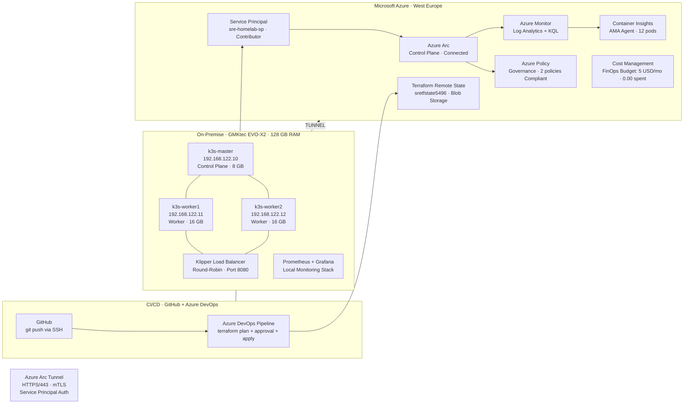

# SRE Homelab: Azure Arc Hybrid Cloud Lab

> **A Proof-of-Value project demonstrating hybrid cloud orchestration, infrastructure-as-code,
> observability, FinOps, Policy as Code, and CI/CD pipeline automation using K3s Kubernetes
> and Microsoft Azure Arc.**


---

## Overview

This project documents the design, deployment, and operation of a production-grade
**hybrid Edge-to-Cloud environment** built on commodity hardware. A three-node K3s
Kubernetes cluster running on-premises (Olsztyn, Poland) is connected to Microsoft
Azure through Azure Arc, enabling centralized governance, monitoring, policy
enforcement, and CI/CD automation from a single cloud control plane.

Built to demonstrate hands-on SRE competencies directly relevant to managing
enterprise SaaS infrastructure at scale.

---

## Architecture



---

## Technology Stack

| Layer             | Technology                          | Purpose                                    |
|-------------------|-------------------------------------|--------------------------------------------|
| Hypervisor        | KVM on Fedora 43                    | Host virtualization                        |
| OS                | Ubuntu Server 24.04 LTS             | All cluster nodes                          |
| Kubernetes        | K3s v1.35.4+k3s1 (Rancher Labs)    | Lightweight K8s distribution               |
| Cloud Bridge      | Azure Arc (agent v1.34.2)           | Hybrid control plane                       |
| Cloud Monitoring  | Azure Monitor + Container Insights  | Telemetry, KQL analytics, alerting         |
| Local Monitoring  | Prometheus + Grafana (Helm)         | Open-source observability stack            |
| Query Language    | KQL (Kusto Query Language)          | Log analytics, SLO calculation             |
| IaC               | Terraform ~3.100 + Remote State     | Infrastructure as Code + Azure Blob state  |
| CI/CD             | Azure DevOps Pipelines              | Automated plan + approval gate + apply     |
| Authentication    | Azure Service Principal             | Non-interactive auth for pipelines         |
| Package Manager   | Helm v3.21.0                        | Kubernetes application deployment          |
| Load Balancer     | K3s Klipper LB                      | Layer 4 round-robin traffic routing        |
| Ingress           | Traefik (built-in K3s)              | Layer 7 routing                            |
| Policy            | Azure Policy (Arc-enabled)          | Policy as Code, governance                 |
| Cost Control      | Azure Cost Management               | FinOps guardrails                          |
| Source Control    | GitHub (SSH auth)                   | Version control, pipeline trigger          |

---

## Key SRE Practices Demonstrated

### FinOps — Cost First
Budget and alerts configured **before any cloud resource was provisioned**.
Hard cap of $5 USD/month with email notifications at 50% and 100% thresholds.
Total cost incurred: **$0.00 USD**.

### Infrastructure as Code — Production Grade
Full Azure infrastructure defined in Terraform:
- Remote state in Azure Blob Storage with lease-based locking
- Blob versioning enabled for state recovery
- Input validation on all variables (email regex, budget range, allowed regions)
- Sensitive outputs marked `sensitive = true`
- Consistent tagging: `environment`, `owner`, `managed_by=terraform`
- Brownfield import documented (`terraform import` for pre-existing resources)

### CI/CD Pipeline — Two-Stage with Approval Gate
```
git push terraform/ → Azure DevOps triggers →
  Stage 1: terraform init + validate + plan (37s) → artifact published →
  APPROVAL GATE (manual review) →
  Stage 2: terraform apply (49s)
```
- Service Principal credentials stored in Variable Group (secrets masked in logs)
- Plan artifact published for review before apply
- Environment `production` with approval check — no unreviewed changes reach infra

### Observability — Three Pillars
- **Metrics:** Azure Monitor + Prometheus (CPU avg 2.20%, RAM avg 12.9%)
- **Logs:** Log Analytics KQL (5 production-ready queries including SLO calculation)
- **Alerts:** OOMKill alert rule via Terraform + Grafana alerting

### SLO Measurement
```kusto
KubeNodeInventory
| where TimeGenerated > ago(24h)
| summarize TotalSamples=count(), ReadySamples=countif(Status=="Ready") by Computer
| extend AvailabilityPct = round(toreal(ReadySamples)/toreal(TotalSamples)*100, 2)
```
**Result: 100% availability — 184/184 samples Ready on all 3 nodes.**

### Incident Management
Blameless postmortem methodology. See [POST-001](docs/POST-001-etcd-split-brain.md).

### Policy as Code
Two K8s policies assigned via Azure CLI (reproducible, auditable):
- No containers running as root
- CPU and memory limits required (max: 500m CPU, 512Mi RAM)
- Both policies: **Compliant**

### Toil Reduction
Manual steps automated with validated Bash scripts:
- `install-k3s-master.sh` — preflight hostname check, sysctl, K3s install, token output
- `install-k3s-worker.sh` — regex hostname validation (prevents etcd split-brain), API reachability check, cluster join

---

## Lab Results

| Metric                      | Week 1         | Week 2 addition        |
|-----------------------------|----------------|------------------------|
| Cluster nodes               | 3 / 3 Ready    | —                      |
| Running pods                | 29             | —                      |
| CPU usage (avg / max)       | 2.20% / 4.84%  | —                      |
| RAM usage (avg / max)       | 12.9% / 14.48% | —                      |
| SLO Availability (24h)      | 100%           | —                      |
| Arc agent uptime            | 12/12 Running  | —                      |
| Load balancer               | Round-robin ✓  | —                      |
| Azure Policy compliance     | 2/2 Compliant  | —                      |
| Terraform state             | Local          | Remote (Azure Blob)    |
| Authentication              | Device code    | Service Principal      |
| CI/CD pipeline              | None           | Azure DevOps (2-stage) |
| Pipeline run time           | —              | 4m 24s                 |
| Issues documented           | 6              | 8 (ISSUE-007, 008)     |
| Cloud cost to date          | $0.00 USD      | $0.00 USD              |

---

## Repository Structure

```
sre-homelab-azure-arc/
├── README.md
├── .gitignore
├── terraform/
│   ├── main.tf                        # RG, Log Analytics, Budget, Alerts, Remote State backend
│   ├── variables.tf                   # Inputs with validation
│   ├── outputs.tf                     # Resource IDs and sensitive keys
│   └── .terraform.lock.hcl           # Provider version pinning
├── k8s/
│   ├── deployment-whoami.yaml         # Demo app: limits, anti-affinity, probes, securityContext
│   └── service-loadbalancer.yaml      # K3s Klipper LB on port 8080
├── scripts/
│   ├── install-k3s-master.sh          # Automated CP bootstrap with preflight checks
│   └── install-k3s-worker.sh          # Worker join with hostname regex validation
├── pipelines/
│   └── terraform-ci.yml               # Azure DevOps: validate+plan → approval → apply
├── monitoring/
│   └── kql-queries.md                 # 10 production-ready KQL queries + SLO calculation
└── docs/
    ├── POST-001-etcd-split-brain.md   # Blameless postmortem with timeline and action items
    ├── SRE_Case_Study_PL_v2.pdf       # Case study (Polish) — Week 1+2
    └── SRE_Case_Study_EN_v2.pdf       # Case study (English) — Week 1+2
```

---

## How to Reproduce

### Prerequisites

- Machine with KVM/libvirt (128 GB RAM recommended, minimum 48 GB)
- Fedora/RHEL/Ubuntu as host OS
- Azure subscription (free tier sufficient — $0.00 cost for this setup)
- Azure CLI, Helm 3, Terraform >= 1.5 installed on host
- Azure DevOps organization (free tier)
- GitHub account

### Step 1 — Create Service Principal

```bash
az login
az ad sp create-for-rbac \
  --name "sre-homelab-sp" \
  --role Contributor \
  --scopes /subscriptions/<YOUR_SUBSCRIPTION_ID>

# Add to ~/.bashrc on all machines:
export ARM_CLIENT_ID="<appId>"
export ARM_CLIENT_SECRET="<password>"
export ARM_TENANT_ID="<tenant>"
export ARM_SUBSCRIPTION_ID="<subscriptionId>"
```

### Step 2 — Provision VMs

```
k3s-master:  192.168.122.10  4 vCPU  8 GB RAM  40 GB disk
k3s-worker1: 192.168.122.11  4 vCPU  16 GB RAM  60 GB disk
k3s-worker2: 192.168.122.12  4 vCPU  16 GB RAM  60 GB disk
```

Ubuntu Server 24.04 LTS, static IPs, OpenSSH enabled.

### Step 3 — Install K3s cluster

```bash
chmod +x scripts/install-k3s-master.sh scripts/install-k3s-worker.sh

# On k3s-master:
./scripts/install-k3s-master.sh

# On k3s-worker1 and k3s-worker2:
./scripts/install-k3s-worker.sh k3s-worker1 192.168.122.11 <NODE_TOKEN>
./scripts/install-k3s-worker.sh k3s-worker2 192.168.122.12 <NODE_TOKEN>
```

### Step 4 — Setup Terraform Remote State

```bash
az group create --name terraform-state-rg --location westeurope
az storage account create --name <unique_name> --resource-group terraform-state-rg \
  --location westeurope --sku Standard_LRS --min-tls-version TLS1_2
az storage container create --name tfstate --account-name <unique_name> --auth-mode login
az storage account blob-service-properties update \
  --account-name <unique_name> --resource-group terraform-state-rg --enable-versioning true
```

Update `terraform/main.tf` backend block with your storage account name, then:

```bash
cd terraform/
terraform init -migrate-state
terraform plan -out=tfplan
terraform apply tfplan
```

### Step 5 — Connect cluster to Azure Arc

```bash
az connectedk8s connect \
  --name K3s-Homelab \
  --resource-group SRE-Lab-RG \
  --location westeurope
```

### Step 6 — Enable Container Insights

```bash
az k8s-extension create \
  --name azuremonitor-containers \
  --cluster-name K3s-Homelab \
  --resource-group SRE-Lab-RG \
  --cluster-type connectedClusters \
  --extension-type Microsoft.AzureMonitor.Containers
```

### Step 7 — Assign Azure Policies

```bash
SUB=$(az account show --query id -o tsv)
az policy assignment create \
  --name "k8s-no-root-containers" \
  --policy "95edb821-ddaf-4404-9732-666045e056b4" \
  --scope "/subscriptions/$SUB/resourceGroups/SRE-Lab-RG" \
  --enforcement-mode DoNotEnforce

az policy assignment create \
  --name "k8s-resource-limits" \
  --policy "e345eecc-fa47-480f-9e88-67dcc122b164" \
  --scope "/subscriptions/$SUB/resourceGroups/SRE-Lab-RG" \
  --enforcement-mode DoNotEnforce \
  --params '{"cpuLimit": {"value": "500m"}, "memoryLimit": {"value": "512Mi"}}'
```

### Step 8 — Setup Azure DevOps Pipeline

1. Create project in Azure DevOps
2. Create Variable Group `terraform-credentials` with ARM_* variables (mark SECRET as secret)
3. Create Environment `production` with Approval check
4. Install extension: [Terraform Tasks](https://marketplace.visualstudio.com/items?itemName=ms-devlabs.custom-terraform-tasks)
5. Create pipeline from existing YAML: `pipelines/terraform-ci.yml`

### Step 9 — Deploy demo application

```bash
kubectl apply -f k8s/deployment-whoami.yaml
kubectl apply -f k8s/service-loadbalancer.yaml

# Verify round-robin load balancing
for i in {1..20}; do curl -s http://192.168.122.10:8080 | grep Hostname; sleep 0.5; done
```

### Step 10 — Install Prometheus + Grafana

```bash
helm repo add prometheus-community https://prometheus-community.github.io/helm-charts
helm repo update
kubectl create namespace monitoring
helm install monitoring prometheus-community/kube-prometheus-stack \
  --namespace monitoring \
  --set grafana.adminPassword=SRE-Lab-2026 \
  --set prometheus.prometheusSpec.retention=24h
```

---

## Cost Summary

| Resource                    | Cost                      |
|-----------------------------|---------------------------|
| Azure Arc (K8s)             | Free                      |
| Log Analytics (< 5 GB)      | Free                      |
| Container Insights          | Free (30-day trial)       |
| Azure Policy                | Free                      |
| Storage Account (state)     | ~$0.01/month              |
| Azure DevOps (free tier)    | Free (up to 1800 min/mo)  |
| **Total**                   | **~$0.01/month**          |

FinOps guardrail: $5 USD/month budget with 50% and 100% email alerts.

---

## Troubleshooting

8 real issues documented with root cause and resolution in the case study PDF.
Key lessons:
- `terraform import` required for brownfield (pre-existing) resources
- AMA v3.x schema differs from omsagent — use `| getschema` to verify columns
- Azure Policy definitions are versioned — check required parameters before assigning
- etcd node identity is immutable — use `kubectl delete node` + re-register, never rename in-place

---

## Author

**Bartosz Suszko**
IT Solutions Bartosz Suszko · Olsztyn, Poland
8+ years in IT infrastructure · Banking · Industrial IoT/OEE
[analitykbiznesowy.pl](https://analitykbiznesowy.pl)
