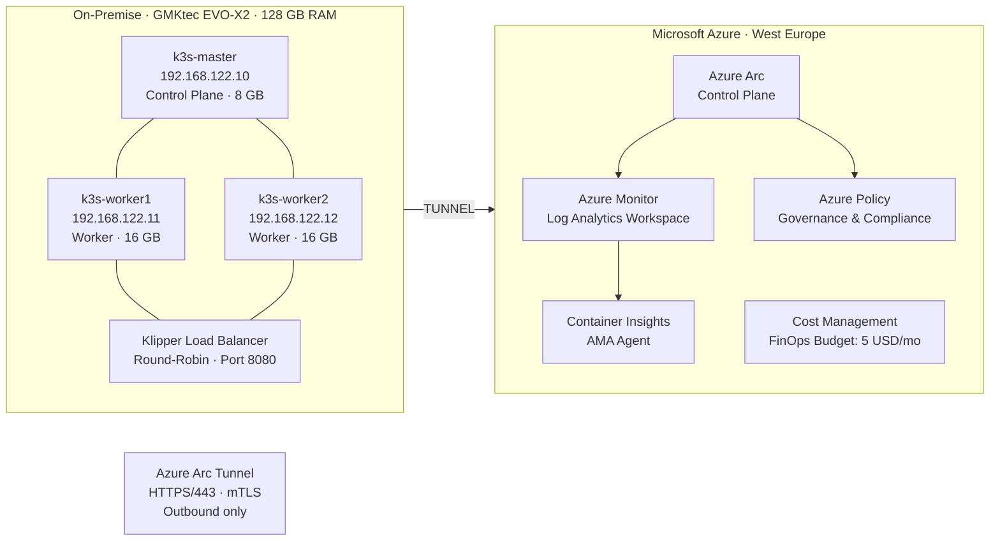

# SRE Homelab: Azure Arc Hybrid Cloud Lab

> **A Proof-of-Value project demonstrating hybrid cloud orchestration, infrastructure-as-code,
> observability, and FinOps practices using K3s Kubernetes and Microsoft Azure Arc.**

---

## Overview

This project documents the design, deployment, and operation of a production-grade
**hybrid Edge-to-Cloud environment** built on commodity hardware. A three-node K3s
Kubernetes cluster running on-premises (Olsztyn, Poland) is connected to Microsoft
Azure through Azure Arc, enabling centralized governance, monitoring, and policy
enforcement from a single cloud control plane.

The lab was built to demonstrate hands-on SRE competencies directly relevant to
managing enterprise SaaS infrastructure at scale.

---

## Architecture



---

## Technology Stack

| Layer             | Technology                          | Purpose                              |
|-------------------|-------------------------------------|--------------------------------------|
| Hypervisor        | KVM (Kernel-based VM) on Fedora 43  | Host virtualization                  |
| OS                | Ubuntu Server 24.04 LTS             | All cluster nodes                    |
| Kubernetes        | K3s v1.35.4 (Rancher Labs)          | Lightweight K8s distribution         |
| Cloud Bridge      | Azure Arc                           | Hybrid control plane                 |
| Monitoring        | Azure Monitor + Container Insights  | Cloud-native observability           |
| Local Monitoring  | Prometheus + Grafana + Loki         | Open-source observability stack      |
| Query Language    | KQL (Kusto Query Language)          | Log analytics and alerting           |
| IaC               | Terraform ~3.100                    | Infrastructure as Code               |
| Package Manager   | Helm 3                              | Kubernetes application deployment    |
| Load Balancer     | K3s Klipper LB                      | Layer 4 round-robin traffic routing  |
| Ingress           | Traefik (built-in K3s)              | Layer 7 routing                      |
| Policy            | Azure Policy (Arc-enabled)          | Governance and compliance            |
| Cost Control      | Azure Cost Management               | FinOps guardrails                    |

---

## Key SRE Practices Demonstrated

### FinOps — Cost First
Budget and alerts were configured **before any cloud resource was provisioned**.
A hard cap of $5 USD/month with email notifications at 50% and 100% thresholds
ensures no surprise billing — a non-negotiable practice for any production SaaS
environment.

### Infrastructure as Code
The entire Azure infrastructure layer (Resource Group, Log Analytics Workspace,
Action Group, Alert Rules, Budget) is defined in Terraform with:
- Input validation on all variables
- Sensitive outputs marked `sensitive = true`
- Consistent tagging strategy via `locals`
- Remote state ready (commented backend block)

### Observability — Three Pillars
- **Metrics:** Azure Monitor + Prometheus (CPU, RAM, pod counts, request rates)
- **Logs:** Log Analytics Workspace + Loki (KubeEvents, ContainerLog, KubePodInventory)
- **Alerts:** Azure Monitor alert rules + Grafana alerting (OOMKill, node NotReady)

### Incident Management
All incidents documented using blameless postmortem methodology. See
[POST-001](docs/POST-001-etcd-split-brain.md) for a real incident from this lab.

### Policy as Code
Azure Policy enforced on the Arc-connected cluster:
- No containers running as root
- CPU and memory limits required on all containers
- Compliance dashboard with before/after remediation evidence

### Toil Reduction
Manual installation steps replaced with parameterized Bash scripts:
- `install-k3s-master.sh` — validates hostname, prepares OS, installs Control Plane, outputs token
- `install-k3s-worker.sh` — validates hostname pattern (prevents etcd split-brain), validates master connectivity, joins cluster

---

## Lab Results

| Metric                   | Value                          |
|--------------------------|--------------------------------|
| Cluster nodes            | 3 / 3 Ready                   |
| Running pods             | 29 (including Arc + AMA agents)|
| CPU usage (avg / max)    | 1.81% / 4.84%                 |
| RAM usage (avg / max)    | 7.31% / 14.48%                |
| Arc agent uptime         | 100% (12 agents, 0 restarts)   |
| Load balancer validation | Round-robin verified (3 nodes) |
| Cloud cost to date       | $0.00 USD                      |
| Time to resolve POST-001 | < 7 minutes                    |

---

## Repository Structure

```
sre-homelab-azure-arc/
├── README.md                          # This file
├── terraform/
│   ├── main.tf                        # Azure resources: RG, Log Analytics, Alerts, Budget
│   ├── variables.tf                   # Inputs with validation
│   └── outputs.tf                     # Resource IDs and keys
├── k8s/
│   ├── deployment-whoami.yaml         # Demo app: resource limits, anti-affinity, probes
│   └── service-loadbalancer.yaml      # K3s Klipper LB on port 8080
├── scripts/
│   ├── install-k3s-master.sh          # Automated Control Plane bootstrap
│   └── install-k3s-worker.sh          # Automated Worker node join with validation
├── monitoring/
│   └── kql-queries.md                 # 10 production-ready KQL queries
└── docs/
    ├── POST-001-etcd-split-brain.md   # Blameless postmortem
    └── SRE_Case_Study_Bartosz_Suszko.pdf
```

---

## How to Reproduce

### Prerequisites

- A machine with KVM/libvirt (128 GB RAM recommended, minimum 48 GB)
- Fedora/RHEL/Ubuntu as the host OS
- Azure subscription (free tier sufficient)
- Azure CLI, Helm 3, Terraform >= 1.5, kubectl installed on host

### Step 1 — Provision VMs

Create 3 VMs using `virt-manager` or `virsh` with static IPs:

```
k3s-master:  192.168.122.10  4 vCPU  8 GB RAM  40 GB disk
k3s-worker1: 192.168.122.11  4 vCPU  16 GB RAM  60 GB disk
k3s-worker2: 192.168.122.12  4 vCPU  16 GB RAM  60 GB disk
```

Install Ubuntu Server 24.04 LTS on each (no LVM, static IP, OpenSSH enabled).

### Step 2 — Install K3s cluster

```bash
# On k3s-master
chmod +x scripts/install-k3s-master.sh
./scripts/install-k3s-master.sh
# Note the NODE_TOKEN printed at the end

# On k3s-worker1 and k3s-worker2
chmod +x scripts/install-k3s-worker.sh
./scripts/install-k3s-worker.sh k3s-worker1 192.168.122.11 <NODE_TOKEN>
./scripts/install-k3s-worker.sh k3s-worker2 192.168.122.12 <NODE_TOKEN>
```

Verify:
```bash
sudo k3s kubectl get nodes
# Expected: 3 nodes, all STATUS=Ready
```

### Step 3 — Provision Azure infrastructure (Terraform)

```bash
cd terraform/
az login
terraform init
terraform plan -out=tfplan
terraform apply tfplan
```

### Step 4 — Connect cluster to Azure Arc

```bash
# On k3s-master
az connectedk8s connect \
  --name K3s-Homelab \
  --resource-group SRE-Lab-RG \
  --location westeurope
```

### Step 5 — Enable Container Insights

```bash
az k8s-extension create \
  --name azuremonitor-containers \
  --cluster-name K3s-Homelab \
  --resource-group SRE-Lab-RG \
  --cluster-type connectedClusters \
  --extension-type Microsoft.AzureMonitor.Containers
```

### Step 6 — Deploy demo application

```bash
kubectl apply -f k8s/deployment-whoami.yaml
kubectl apply -f k8s/service-loadbalancer.yaml

# Verify round-robin load balancing
while true; do curl -s http://192.168.122.10:8080 | grep Hostname; sleep 0.5; done
```

### Step 7 — Install Prometheus + Grafana (optional)

```bash
helm repo add prometheus-community https://prometheus-community.github.io/helm-charts
helm repo update
kubectl create namespace monitoring
helm install monitoring prometheus-community/kube-prometheus-stack \
  --namespace monitoring \
  --set grafana.adminPassword=SRE-Lab-2026
```

---

## Cost Management

All Azure resources used in this lab fall within the **Azure free tier** or have
minimal cost when used at lab scale:

| Resource              | Cost            |
|-----------------------|-----------------|
| Azure Arc (K8s)       | Free            |
| Log Analytics (< 5GB) | Free            |
| Container Insights    | Free (30 days)  |
| Azure Policy          | Free            |
| **Total**             | **$0.00/month** |

A $5 USD/month budget with alerts is configured as a FinOps guardrail regardless.

---

## Author

**Bartosz Suszko**  
IT Solutions Bartosz Suszko · Olsztyn, Poland  
8+ years in IT infrastructure · Banking · Industrial IoT/OEE  
[analitykbiznesowy.pl](https://analitykbiznesowy.pl)
